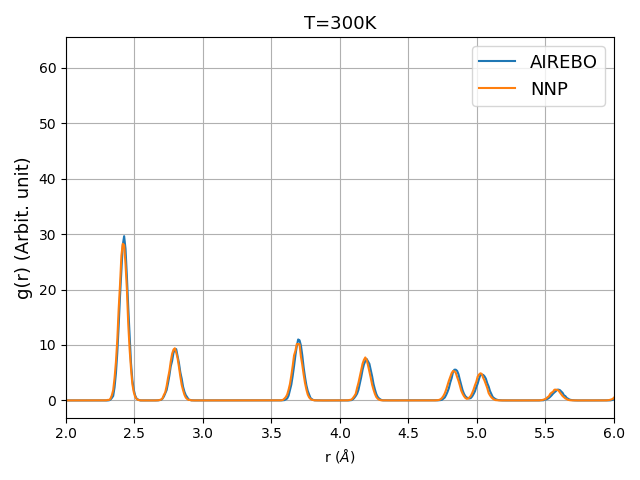
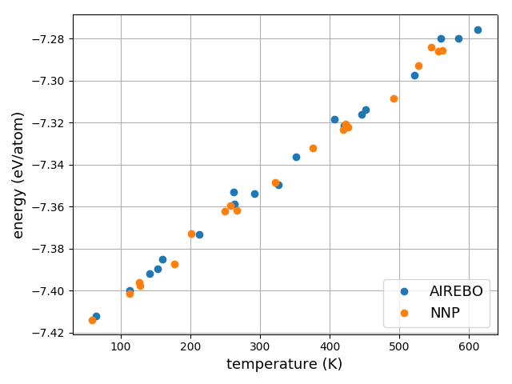

# Graphene Neural Network Potential

This repo (*graphne-nnp*) presents the interatomic potential development for a graphene monolayer using high-dimensional neural network methodology as implemented in the [RuNNer](http://www.uni-goettingen.de/de/560580.html) code and the [N2N2](https://github.com/CompPhysVienna/n2p2) C++ library interfaced with [LAMMPS](https://lammps.sandia.gov/) package.

## Before using it:
Make sure that the [RuNNer](http://www.uni-goettingen.de/de/560580.html) code and [LAMMPS](https://lammps.sandia.gov/) with *pair_style nnp* are built on your machine. For more details, please refer to the documentations.

## How does it work?
1. The `md.airebo.in` script reads the initial graphene structure `grn.lmp` from  `lmp` directory, performing a molecular dynamics (MD) simulation in  order to generate the initial dataset, and save it into `airebo.data`.
```
lmp_serial < md.airebo.in > lmp/md.airebo.out
```

2. The `lammps_to_runner.py` Python script converts the initial dataset `airebo.data` to the [RuNNer](http://www.uni-goettingen.de/de/560580.html) input data format `input.data`.
```
python lammps_to_runner.py lmp/airebo.data nnp/input.data
```

3. Using [RuNNer](http://www.uni-goettingen.de/de/560580.html) in mode 1 and 2 in order to generate symmetric functions and train the neural network potential (NNP), respectively.
```
cd nnp
sh runscript.sh > runscript.out
cd ..
```

4. The `md.nnp.in` performs MD simulation using developed NNP in `nnp` directory and predicts trajectory of atoms for several next time steps (i.e. 100) and save the configurations into `nnp.data`.
```
rm -f lmp/nnp.data
lmp_serial < md.nnp.in > lmp/md.nnp.out
```

5. The `rerun.airebo.in` reads `nnp.data` structure file and performs single point calculation for each snapshot (configuration) obtained from previous step including energy, forces, charges, etc.

6. The otained data in previous step is appended to the 'airebo.data' and repeat it from **step 2**.
```
lmp_serial < rerun.airebo.in > lmp/rerun.airebo.out
```

This procedure constantly increases the size of dataset in order to effectively find holes in potential energy surface. It is eventually has to be stopped when a desired accuracy achieved. At this point, `pred.md.nnp.in` can be used to perform the desired large-scale MD simulation. For sake of comparison,  `pred.md.airebo.in` script with the AIREBO potential is also available.

All the steps can automatically apply by running `train_nnp.sh`.

## Results (primary):
Comparison between the trained NNP and AIREBO potentials (for a supercell of 2x2x1):
- Radial distribution functions
<p align="center">
  
</p>

- Energy per atom as function of temperature
<p align="center">
  
</p>  
